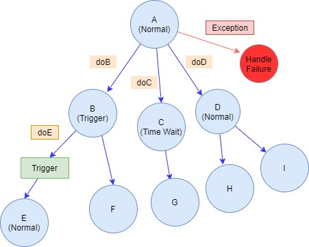
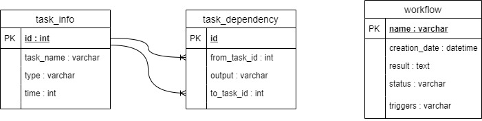
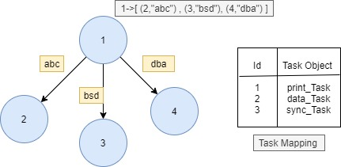
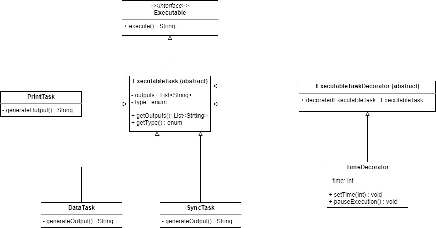

# Workflow Manager
## Problem Statement


ASFT as an org has orchestrator systems which interacts with multiple other services(hosted on different platforms, EC2, Lambda, ECS etc.). An orchestrator or a workflow system is one which coordinates which multiple other services to achieve desired result for the customer. 


**As an orchestrator:**
```text
1. I should be able to define dependencies among tasks. eg. execute task B should be executed post task A.
2. I should be able to execute multiple task in parallel.
3. I should be call a task B only when output from task A meets certain criteria.
        say output of tasks A is a field X.
        if X == 'doB' then executeTaskB
        if X == 'doC' then executeTaskC

4. I should able to define failure handling task for each of those tasks.
5. I should be able to search execution of tasks in a workflow by a tagged id
6. I should be able to support multiple type of tasks(Lambda, ECS etc.)
```


### This represents a directed acyclic graph

1. Dummy Task Implementations are used in the project as follows:
    * printTask
    * dataTask
    * syncTask ...
    
2. It have three types of tasks :
    1. Normal : After normal Execution generates an output
    2. Trigger Wait : Halts Execution until a trigger is pressed
    3. Time Wait : Sole purpose is to add delay between execution of two tasks 

## Technology Stack
* Back End
    * Java
    * Spring Boot Web (MVC Framework)
* Front End
    * Bootstrap
    * Thymeleaf Template Engine
* Database
    * Mysql
    
## Database Model of Project



* Task_Info holds information of user defined tasks.
* Task_Dependency holds edges of the graph.
* workflow will save result outcome of each workflow with status field to monitor the execution

## Creating Dependency Graph


Adjacency List is used to create graph. First I fetch all dependencies, then use Map data structure to map each task id to its adjacent task id along 
with corresponding output, so it is constructed like `Map<Integer,List<Pair<Integer,String>>>`. A TaskMapping is maintained to associate Task Instances with their
id like `Map<Integer,Task>` . Graph is also provided with a recovery mechanism which defines the number of retries and exponent for wait.

## Executing workflow
So execution always starts from `Task ID: 1`. then we fetch corresponding task from taskMapping created in dependeny graph. each task will have execute() method
that generate a `String output` because every task implements executable interface. 
* `If Exception is thrown` : We catch the exception and call the recovery mechanism defined in the dependency graph.
* `Else : ` 
    * `If output is null: ` It indicates we executed a leaf task, append the result in workflow and change workflow status to `SUCCESS`. terminate Execution.
    * `If output is String: ` 
         * `case NORMAL task` : Append the result to workflow, then iterate over edges and find the matching edge, then recursively start the execution.
         * `case TRIGGER_WAIT task ` : Append the result to workflow. Change workflow status to `TRIGGER_WAIT` and terminate Exection.Execution will continue after trigger is recieved.
         * `case TIME_WAIT task `: Before execution starts change workflow tag to time_wait so that html shows relative messages.Append the result to workflow and change status to normal.
                                    Find matching edge and recursively start execution.
                                    
## Task UML Diagram


Decorator design pattern adds dynamic functionality to an object at runtime. So we use it to add pauseExecution() functionality to the object.

## Handling Failed Tasks

Recovery Mechanism is defined on the graph level. Graph bean will hold instance of recovery mechanism. It defines number of attemps and exponent of waiting. When we call recover method, It will count number of previous failures. If count of previous fails is more than maxAttempsthen we declare workflow to FAILED status, else we try execution from same point again.

